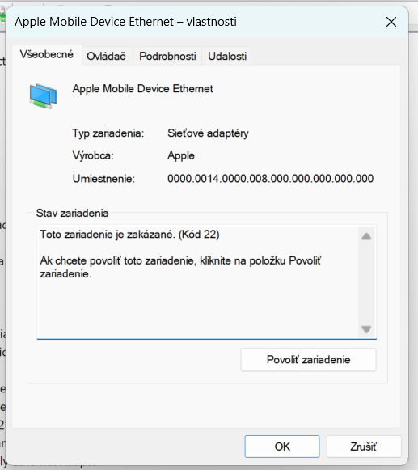

## Úloha 1

Aká ikona sa objavila pri zariadení?

----------------------
## Funguje Internet?

Nie

----------------------

## Krok 4: Diagnostikujte problém:

-----------------------

## Úloha 2 

-----------------------

## Krok 2: Vyplňte tabuľku

| Údaj                         | Hodnota |
|------------------------------|---------|
| Počet fyzických diskov      |   1    |
| Typ rozdelenia (MBR/GPT)    |   guid     |
| Celková kapacita Disku 0    |     957,74 GB    |
| Počet partícií na Disku 0   |   5      |
| Súborový systém na C:       |     NTFS    |
| Voľné miesto na C:          |    119 GB     |

